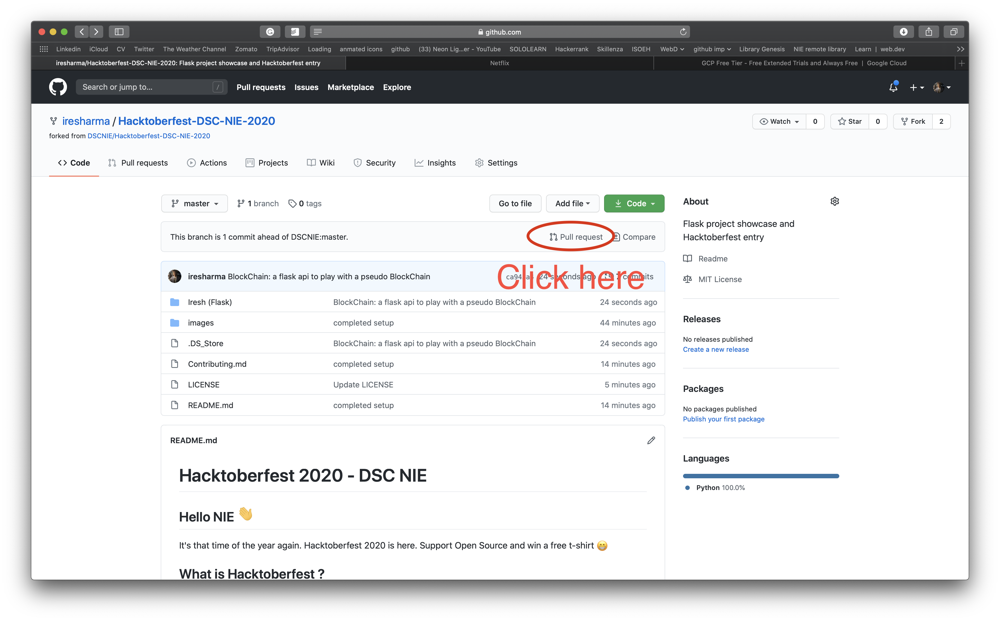
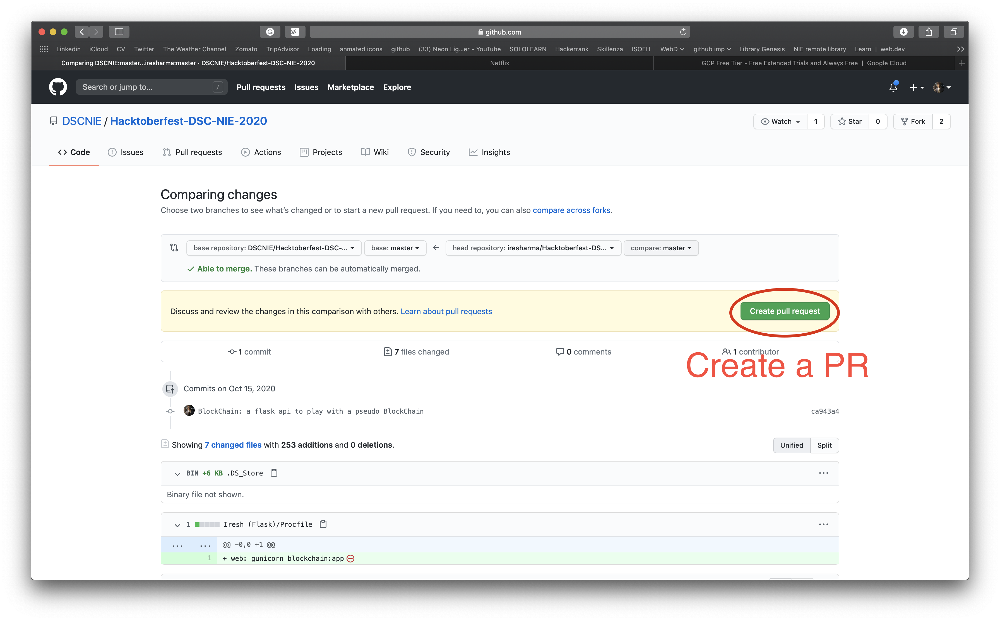

<p align="center">
    
</p>


# A Guide to making your first Pull Request

### Requirements

1. An account on [github.com](https://www.github.com)
2. git
3. A curious mind

> Go ahead and get yourself an account on [github.com](https://www.github.com)

* If you're on windows, download git from https://git-scm.com/downloads
* If you're on Ubuntu, run `sudo apt install git`

Here's a great tutorial on git and github, make sure you know the basics of git before moving ahead.
https://youtu.be/SWYqp7iY_Tc

Done with the video ? Cool, follow the following steps.

<br>

### Fork the repository and clone it


### Copy the link from your forked repository


### Clone the repository
```bash
git clone <enter_your_copied_url>
cd Hacktoberfest-DSC-NIE-2020
```

To know more about cloning and forking a repository check [this](https://help.github.com/en/articles/fork-a-repo) out!

## Make a directory by your name 
```bash
mkdir <your_name>
cd <your_name>
```
### Put the programs in your directory
> Note: Put your programs inside the directory of your name only. Try and keep one pull request per program you add. You can have a look
> at the example programs already added

<br>

## Commit and Push your changes

* ***Inside the Hacktoberfest-DSC-NIE-2020***

```bash
# Do this once, only for the first time
git remote add upstream https://github.com/DSCNIE/Hacktoberfest-DSC-NIE-2020.git
``` 

Commit your changes

```bash
git add .
git commit -m "<Program Name> : <Program Description>"
```

To know more about making commits check out [this](https://help.github.com/en/articles/pushing-commits-to-a-remote-repository) link


## Sync your forked repository with the original repository

> To avoid merge conflicts and make clean pull requests

```bash
git pull upstream master
```

To know more about syncing a fork check out [this](https://help.github.com/en/articles/syncing-a-fork) awesome link by github


### Push the changes to your forked repository

```bash
git push origin master
```

<br>


## **Make a pull request**

*click on pull request in your forked repository*


<br>

*then click on create pull request*


**Now the owner of the repository will accept your pull request and merge changes with the original repository**

**Now make 4 pull requests more and get ready to win those awesome hacktoberfest rewards**

* To know more about making a pull request check out [this](https://help.github.com/en/articles/creating-a-pull-request) link
* To know more about contributing to open source check out [this](https://opensource.guide/how-to-contribute/) awesome guide!


## Resources and Tutorials

* https://www.digitalocean.com/community/tutorial_series/an-introduction-to-open-source
* https://opensource.guide/
* https://dev.to/t/opensource
* https://www.digitalocean.com/community/tutorials/how-to-create-a-pull-request-on-github
* https://github.github.com/training-kit/
